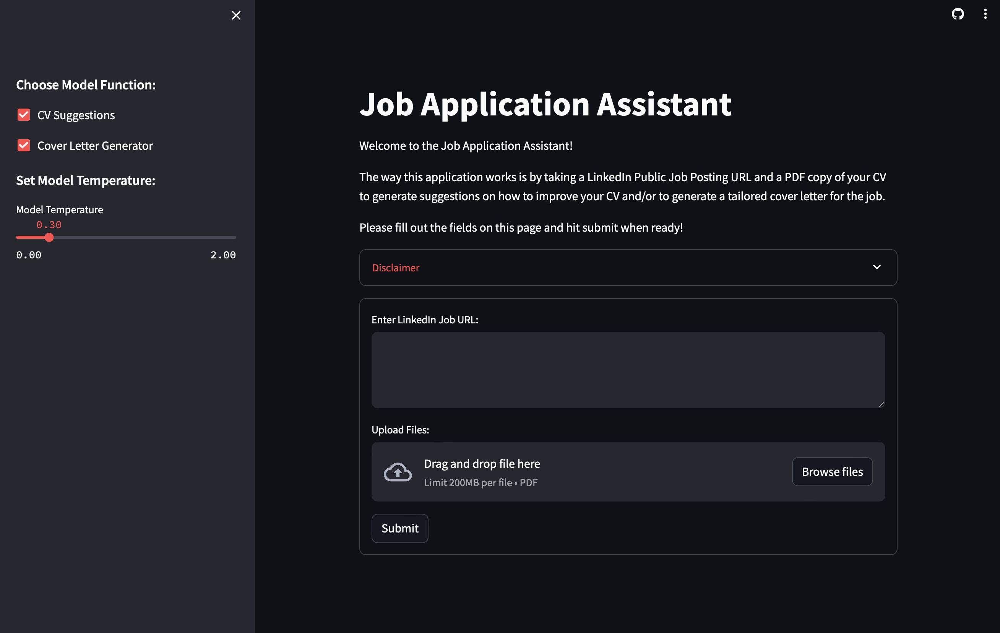

# ChatGPT Job Application Assistant

#### Application Link: https://jpschloss-job-application-assistant.streamlit.app

### Background
This is a sample project created and developed to help job seekers with the application process. This tool takes your resume or CV as a PDF, and a specific job description, to give customized recommendations on how you can improve your resume. The application also works to generate a draft Cover Letter, that you can work to incorporate into your applications. 

One of the most impoortant steps in applying to a job is custom tailoring your resume to that specific job. You want to highlight how you are a match with the position, and that you have the skillsets to achieve success in the role. This application helps make that process a bit easier. 

### How Does It Work?
1. If the Open AI API Key is being requested on the side bar, go ahead and enter your API key there. If it is not present, that just means I have it connected to the API and am covering its operating cost. 

2. Find the job posting link that you would like to use for the recommendations. This should be a job posting from LinkedIn and should use the permanant link for the page. This can be found by clicking on the curved arrow at the top of a job posting and selecting 'Copy link' from the menu. 

3. Drag and drop, or browse, for you current CV or Resume. As a note here, OpenAI's API is used in this tool, so please make sure that you remove any personally identifiable information or any type of confidential or sensitive information from you CV before passing it into this tool. 

4. Feel free to adjust the model temperature. The higher the temperature, the more creative the model will be. But, this may also cause the model to hallucinate more. 

5. Click on 'Submit' and let the application process. 

#### Thanks y'all and happy coding! 

